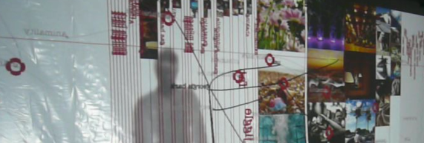

DarkMatr is **an interactive installation** that used the web as if it was a database for collective human intelligence. Using data vizualisation graphics, cinema immersion, open source software and new media (thermal camera and biofilm screen), the human body became a physical interface to connect with the virtualized knowledge of the net.

DarkMatr investigated the way data from the web and our physical world can be merged and presented in a total user experience.
Nodebox and some of the libraries were used to create a **repository of information and content** linked to all nouns in the english language.

DarkMatr was an **Art&D project funded by the IBBT** (Interdisciplinary Institute for Broadband Technology, Ghent, Belgium) and by the VGC (Flemish Community Commission of Brussels) and had the support of 

* EMRG Nodebox (KdG, Antwerp)
* CUO (University of Leuven, Belgium)
* Wica (University of Gent)
* iMAL (Center for Digital Cultures and Technology, Brussels)
* Nadine/Plateau

It received additional support of XenICs and Jemaco.

DarkMatr, a project **produced by Tom Heene** in collaboration **with  Pieter Heremans, Lieven Menschaert, Lionel Maes, Olivier Meunier, Gert Aertsen and Dries De Roeck**.

<object width="700" height="450">
<param value="true" name="allowfullscreen"/>
<param value="always" name="allowscriptaccess"/>
<param value="http://vimeo.com/moogaloop.swf?clip_id=9608911&server=vimeo.com&show_title=1&show_byline=1&show_portrait=0&color=&fullscreen=1" name="movie"/>
<embed width="700" height="450" allowscriptaccess="always" allowfullscreen="true" type="application/x-shockwave-flash" src="http://vimeo.com/moogaloop.swf?clip_id=9608911&server=vimeo.com&show_title=1&show_byline=1&show_portrait=0&color=&fullscreen=1" style="display: inline;"/>
  </object>